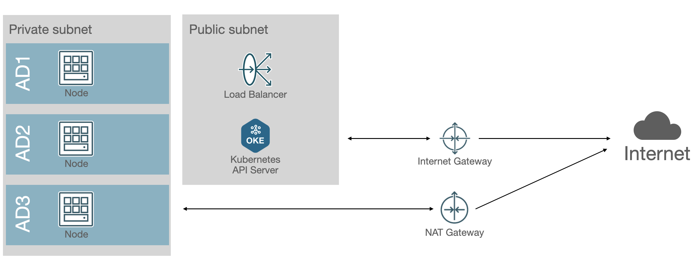

# Terraform OKE Cluster

This is a demo project to showcase OKE terraform module.




# Installation

## prerequisites

- oci: 3.37.12
- terraform: v1.5.7
- kubectl: v1.28.3
- helm: v3.13.1

## 1. Create .auto.tfvars file

```
tenancy_id       = "skylark"
tenancy_ocid     = "ocid1.tenancy.oc1..skylark"
compartment_id   = "ocid1.compartment.oc1..skylark"
user_ocid        = "ocid1.user.oc1..skylark"
private_key_path = "~/.oci/oci_api_key.pem"
fingerprint      = "sk:la:rk"
```

## 2. Terraform init

```
terrafrom init
```

### 3. Terraform plan

```
terraform plan
```

### 4. Terraform apply

```
terraform apply
```

### 5. Get kubeconfig

### 6. Install software stack

```
./scripts/install-kubernetes-stack.sh
```

### 7. Install httpbin server

```
./scripts/install-httpbin-app.sh
```
